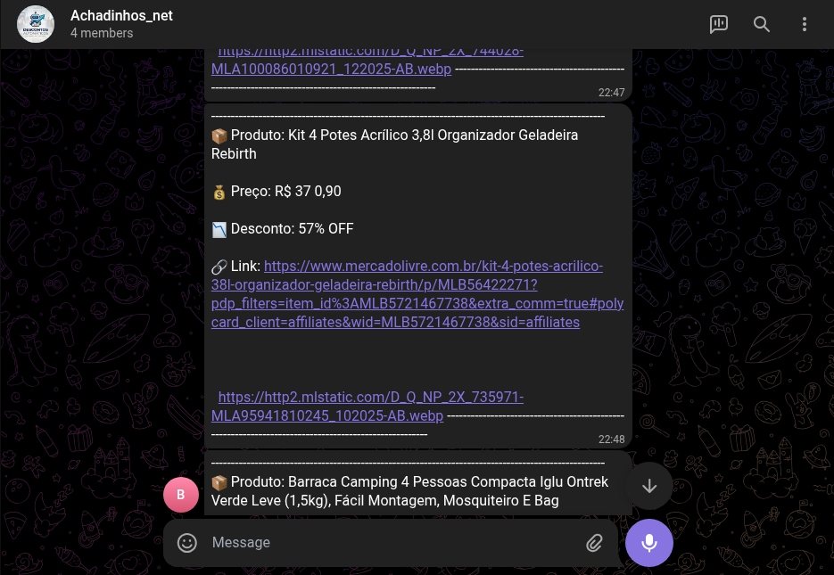

# 🤖 Bot de Automação de Produtos para Telegram
## Em Construção

## 📌 Sobre o Projeto 1.0
Este projeto consiste no desenvolvimento de um bot para Telegram capaz de automatizar a busca, organização e envio de produtos para usuários.

A proposta é criar uma solução eficiente para facilitar a divulgação de produtos, podendo ser utilizada em:
- Marketing de afiliados
- E-commerce
- Grupos e canais de ofertas

---

## 🚀 Funcionalidades

- 🔎 Busca automática de produtos
- 📦 Coleta de dados (nome, preço, link, etc.)
- 📲 Envio automático via Telegram
- ⚡ Atualizações em tempo real
- 🎯 Filtros personalizados (em desenvolvimento)

---

## 🛠️ Tecnologias Utilizadas

- **Python** → Lógica e automação
- **Selenium / BeautifulSoup** → Web scraping
- **APIs externas** → Coleta de dados
- **Telegram Bot API** → Integração com o Telegram

---

## 📂 Estrutura do Projeto

```bash
bot-telegram/
│
├── src/
│   ├── bot.py            # Lógica principal do bot
│   ├── scraper.py        # Coleta de dados dos produtos
│   ├── api.py            # Integração com APIs externas
│   └── utils.py          # Funções auxiliares
│
├── data/
│   └── produtos.json     # Armazenamento dos dados
│
├── requirements.txt      # Dependências do projeto
└── README.md             # Documentação
